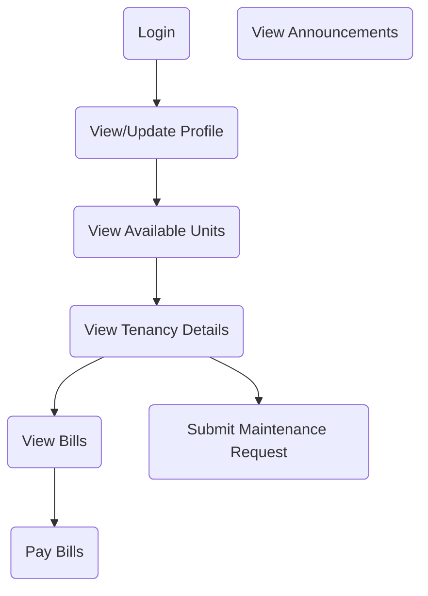
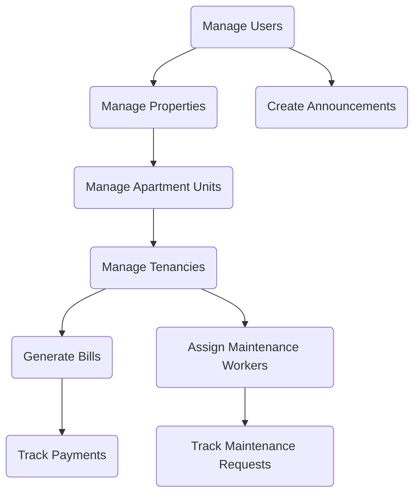

# Data Flow for Ocampo Apartments

This document describes the main data flows for each actor in the system, based
on the user stories in [stories.md](./stories.md).

---

## Tenant Data Flow

### Tenant Flow Explanation (Grouped by User Stories)

#### Users

- **Login:** Tenants log in to the system after being registered by an
  administrator ([stories.md](./stories.md): Users).

#### Tenants

- **View/Update Profile:** Tenants manage their personal/contact info (Tenants).

#### Apartment Units

- **View Available Units:** Tenants browse available apartment units (Apartment
  Units).

#### Tenancies

- **View Tenancy Details:** Tenants see their lease/unit info (Tenancies).

#### Bills & Bill Items

- **View Bills:** Tenants view their bills and breakdown (Bills & Bill Items).

#### Payments

- **Pay Bills:** Tenants pay bills and upload proof (Payments). Payment status
  is updated for admin.

#### Maintenance Requests

- **Submit Maintenance Request:** Tenants submit requests for their unit
  (Maintenance Requests).

#### Announcements

- **View Announcements:** Tenants see announcements from admins (Announcements).

---

## Administrator Data Flow

### Administrator Flow Explanation (Grouped by User Stories)

#### Users

- **Register Tenants:** Admins create tenant user accounts and assign roles
  ([stories.md](./stories.md): Users, Tenants).
- **Manage Users:** Admins activate/deactivate accounts and manage roles
  ([stories.md](./stories.md): Users).

#### Properties

- **Manage Properties:** Admins add/manage properties (Properties).

#### Apartment Units

- **Manage Apartment Units:** Admins add/manage units (Apartment Units).

#### Tenancies

- **Manage Tenancies:** Admins link tenants to units and manage leases
  (Tenancies).

#### Bills & Bill Items

- **Generate Bills:** Admins create bills and add items (Bills & Bill Items).

#### Payments

- **Track Payments:** Admins verify payments and update bill status (Payments).

#### Maintenance Workers & Requests

- **Assign Maintenance Workers:** Admins assign workers to requests (Maintenance
  Requests, Maintenance Workers).
- **Track Maintenance Requests:** Admins monitor request status (Maintenance
  Requests).

#### Announcements

- **Create Announcements:** Admins broadcast messages to all users
  (Announcements).
