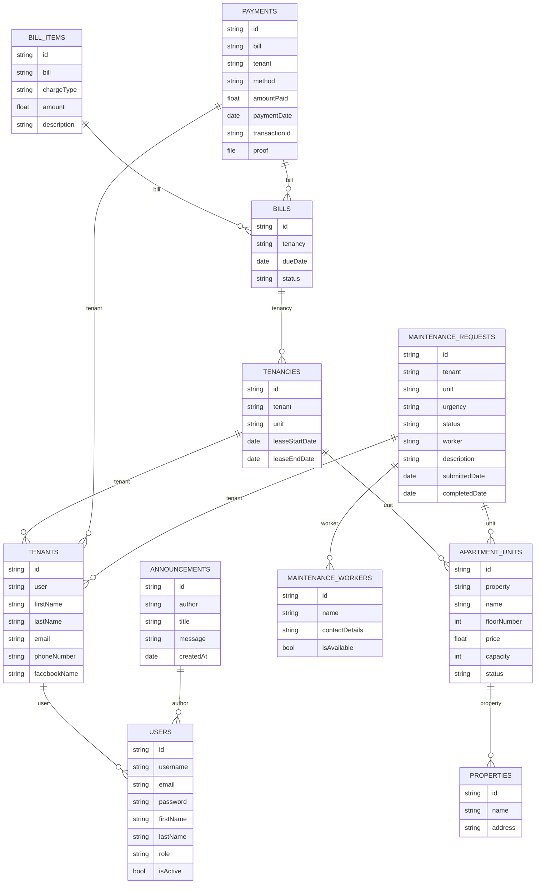

# PocketBase Collection Schemas

Here are the detailed table structures based on your ERD diagram, designed for a
PocketBase implementation. The original lookup tables have been converted into
Select fields for simplicity.

## Core Entities

### 1. Users (PocketBase Default)

This collection utilizes PocketBase's built-in users collection, extending it
with custom fields.

| Field Name | Type       | Options                               | Description                               |
| ---------- | ---------- | ------------------------------------- | ----------------------------------------- |
| id         | Base Model | (auto-generated)                      | Unique record ID.                         |
| username   | Text       | Required, Unique                      | User's login username.                    |
| email      | Email      | Required, Unique                      | Unique email for login and notifications. |
| password   | Password   | Required                              | Hashed user password.                     |
| firstName  | Text       |                                       | User's first name.                        |
| lastName   | Text       |                                       | User's last name.                         |
| role       | Select     | Administrator, Building Admin, Tenant | Links to the user's assigned role.        |
| isActive   | Bool       | Default: true                         | For deactivating user accounts.           |

### 2. Tenants

Stores detailed information about individual tenants.

| Field Name   | Type       | Options          | Description                            |
| ------------ | ---------- | ---------------- | -------------------------------------- |
| id           | Base Model | (auto-generated) | Unique record ID.                      |
| user         | Relation   | Required, users  | Links to the user's login account.     |
| firstName    | Text       | Required         | Tenant's first name.                   |
| lastName     | Text       | Required         | Tenant's last name.                    |
| email        | Email      |                  | Email address for notifications.       |
| phoneNumber  | Text       |                  | Tenant's contact phone number.         |
| facebookName | Text       |                  | Tenant's name on Facebook for contact. |

### 3. Properties

Represents the physical property locations or branches.

| Field Name | Type       | Options          | Description                   |
| ---------- | ---------- | ---------------- | ----------------------------- |
| id         | Base Model | (auto-generated) | Unique record ID.             |
| name       | Text       | Required         | e.g., "Quezon City Branch"    |
| address    | Text       | Required         | Full address of the property. |

### 4. Apartment Units

Details for each individual apartment unit within a property.

| Field Name  | Type       | Options              | Description                           |
| ----------- | ---------- | -------------------- | ------------------------------------- |
| id          | Base Model | (auto-generated)     | Unique record ID.                     |
| property    | Relation   | Required, properties | The property this unit belongs to.    |
| name        | Text       | Required             | Unit identifier, e.g., "Unit 201".    |
| floorNumber | Number     |                      | The floor the unit is on.             |
| price       | Number     | Required             | Monthly rental price.                 |
| capacity    | Number     |                      | Maximum number of occupants.          |
| status      | Select     | Available, Occupied  | Current occupancy status of the unit. |

### 5. Tenancies

The link between a tenant and the unit they are leasing.

| Field Name     | Type       | Options                   | Description                        |
| -------------- | ---------- | ------------------------- | ---------------------------------- |
| id             | Base Model | (auto-generated)          | Unique record ID.                  |
| tenant         | Relation   | Required, tenants         | The tenant in the lease agreement. |
| unit           | Relation   | Required, apartment_units | The unit being leased.             |
| leaseStartDate | Date       | Required                  | The start date of the lease.       |
| leaseEndDate   | Date       |                           | The end date of the lease.         |

### 6. Bills

Represents a bill generated for a tenancy, which can include multiple items.

| Field Name | Type       | Options             | Description                   |
| ---------- | ---------- | ------------------- | ----------------------------- |
| id         | Base Model | (auto-generated)    | Unique record ID.             |
| tenancy    | Relation   | Required, tenancies | The tenancy this bill is for. |
| dueDate    | Date       | Required            | The date the bill is due.     |
| status     | Select     | Paid, Due, Overdue  | Current status of the bill.   |

### 7. Bill Items

Individual line items that make up a bill (e.g., rent, utilities).

| Field Name  | Type       | Options                  | Description                        |
| ----------- | ---------- | ------------------------ | ---------------------------------- |
| id          | Base Model | (auto-generated)         | Unique record ID.                  |
| bill        | Relation   | Required, bills          | The bill this item belongs to.     |
| chargeType  | Select     | Rent, Water, Electricity | The type of charge.                |
| amount      | Number     | Required                 | The amount for this specific item. |
| description | Text       |                          | e.g., "Monthly Rent for August"    |

### 8. Payments

Records payments made by tenants towards their bills.

| Field Name    | Type       | Options                 | Description                              |
| ------------- | ---------- | ----------------------- | ---------------------------------------- |
| id            | Base Model | (auto-generated)        | Unique record ID.                        |
| bill          | Relation   | Required, bills         | The bill this payment is for.            |
| tenant        | Relation   | Required, tenants       | The tenant who made the payment.         |
| method        | Select     | Over the counter, GCash | The method used for payment.             |
| amountPaid    | Number     | Required                | The amount that was paid.                |
| paymentDate   | Date       | Required                | Timestamp of when the payment was made.  |
| transactionId | Text       |                         | e.g., GCash Reference Number.            |
| proof         | File       |                         | Uploaded screenshot or proof of payment. |

### 9. Maintenance Workers

Information about maintenance personnel.

| Field Name     | Type       | Options          | Description                         |
| -------------- | ---------- | ---------------- | ----------------------------------- |
| id             | Base Model | (auto-generated) | Unique record ID.                   |
| name           | Text       | Required         | Full name of the worker.            |
| contactDetails | Text       |                  | Phone number or other contact info. |
| isAvailable    | Bool       | Default: true    | Availability status of the worker.  |

### 10. Maintenance Requests

Tracks maintenance requests from tenants.

| Field Name    | Type       | Options                          | Description                               |
| ------------- | ---------- | -------------------------------- | ----------------------------------------- |
| id            | Base Model | (auto-generated)                 | Unique record ID.                         |
| tenant        | Relation   | Required, tenants                | The tenant who submitted the request.     |
| unit          | Relation   | Required, apartment_units        | The unit the request is for.              |
| urgency       | Select     | Urgent, Normal, Low              | Urgency level of the request.             |
| status        | Select     | Pending, Acknowledged, Completed | Current status of the request.            |
| worker        | Relation   | maintenance_workers              | Assigned maintenance personnel.           |
| description   | Text       | Required                         | Detailed description of the issue.        |
| submittedDate | Date       | Required                         | When the request was submitted.           |
| completedDate | Date       |                                  | Timestamp of when the work was completed. |

### 11. Announcements

For broadcasting messages to users.

| Field Name | Type       | Options          | Description                           |
| ---------- | ---------- | ---------------- | ------------------------------------- |
| id         | Base Model | (auto-generated) | Unique record ID.                     |
| author     | Relation   | Required, users  | The admin user who created it.        |
| title      | Text       | Required         | The title of the announcement.        |
| message    | Editor     | Required         | The main content of the announcement. |
| createdAt  | Date       | (auto-generated) | Timestamp of creation.                |
